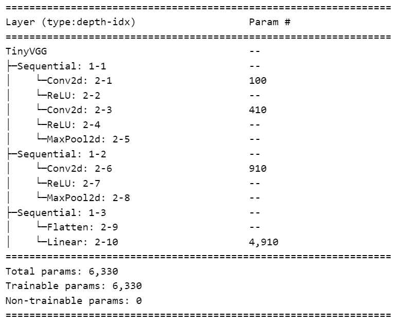

# Handwritten Digit Recognition from MNIST Dataset

This Project has a model called TinyVGG trained on MNIST dataset and uses Streamlit to run UI.

**You can experience how the model runs and works by visiting the streamlit app :** [https://recognize-handwritten-digits.streamlit.app/](https://recognize-handwritten-digits.streamlit.app/)

---

## Demo

https://github.com/IIsameerII/Handwritten-Digit-Recognition-from-MNIST-Dataset/assets/88422517/f7679dcb-9b41-42a7-be9d-35a32dc3c5d4

## Setup

Firstly, clone the repository. Then, install required libraries to run the repository. You can use the CLI command -

```
pip install -r requirements.txt
```

Run the main.py file

```
python main.py
```

When you have ran the script, you would get a streamlit command to run in your terminal. Copy and past the command in your terminal.

NOTE : Ensure that the absolute address of main.py dosen't contain any spaces. If there are spaces, put "double quotes" around the address to make sure the streamlit run command works without any issues.

```
streamlit run "C:/`<ABSOLUTE FILE ADDRESS>`/Handwritten-Digit-Recognition-from-MNIST-Dataset/main.py"
```

You should see the following output -

*You can now view your Streamlit app in your browser.*

*Local URL: [http://localhost:8501
*Network URL:* ](http://localhost:8501)*[http://192.168.1.91:8501](http://192.168.1.91:8501)**

## Dataset

Binary representations of commonly used handwritten digits for image processing system training are available in the MNIST database. The data was gathered from high school students and Census Bureau staff. The database has 10,000 testing digits and 60,000 training digits that have all been size-normalized, centered, and placed within a 28 by 28 pixel fixed-size picture.

## TinyVGG Architecture



Source : [https://poloclub.github.io/cnn-explainer/](https://poloclub.github.io/cnn-explainer/)
